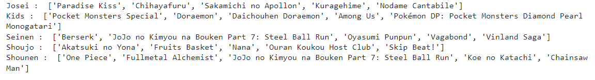
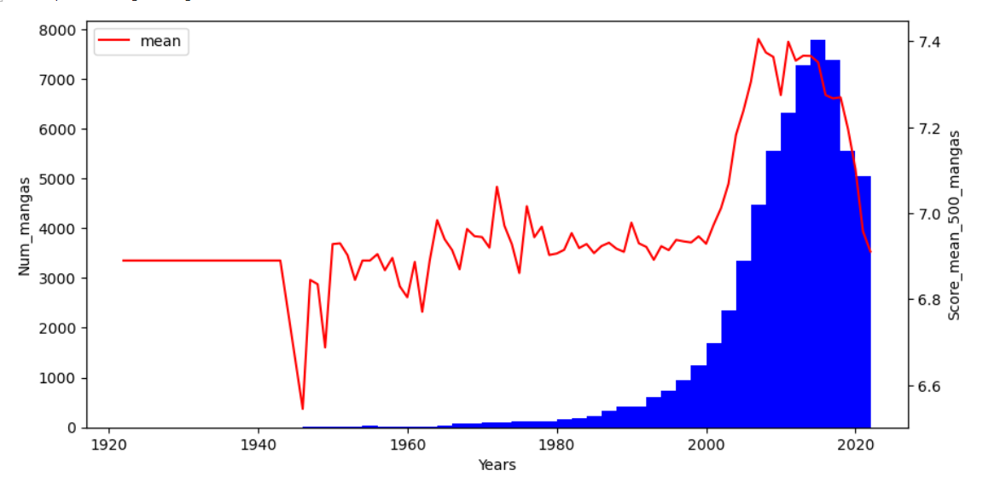
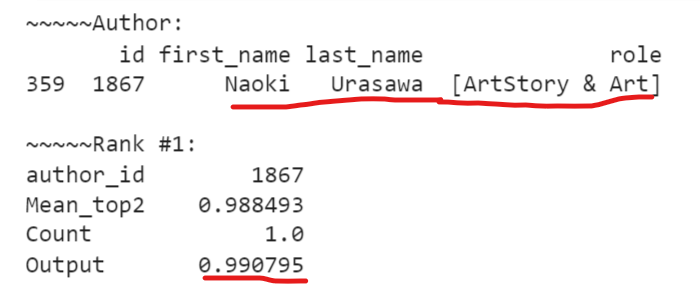
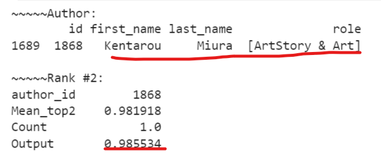
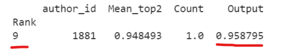
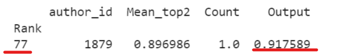
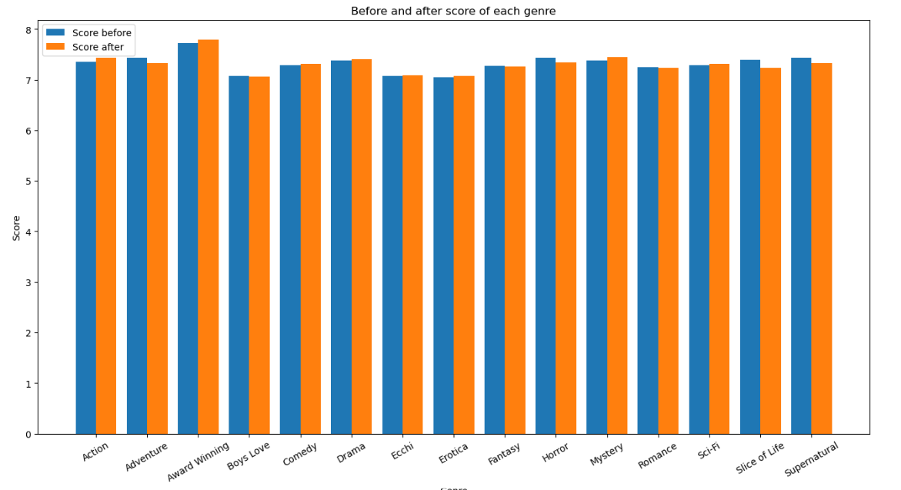
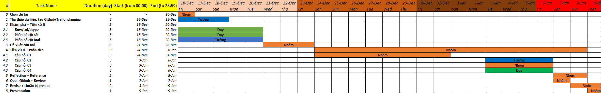

# PROGRAMMING FOR DATA SCIENCE - FIT - HCMUS
## Final Project - Thu thập, phân tích cho trả lời câu hỏi về bộ dữ liệu MyAnimeList
### I. Thông tin nhóm:
- Lớp: 20KHDL2

#|Họ tên
-|-
20127383|Lê Ngọc Tường
20127484|Nguyễn Tư Duy

### II. Thông tin đề tài:
#### **_01. Dataset:_**
[MyAnimeList Anime and Manga Datasets](https://www.kaggle.com/datasets/andreuvallhernndez/myanimelist) chứa thông tin của 67.273 bộ truyện.

#### **_02. Meaningful questions:_**
- Những bộ manga nào là phù hợp đối với mỗi đối tượng (`demographics`)?
  - _Mục đích:_ Cải thiện hệ thống khuyến nghị (recommendation system) của MAL.
- Đâu là những thời điểm bùng nổ của manga, phân tích 3 đặc điểm của thời kì này: thể loại chủ đề, score mean, tỉ lệ thành công manga đến thời điểm hiện tại.
  - _Mục đích:_ Phân tích này mang ý nghĩa thông kê, phân tích để thấy được quá trình phát triển của của ngành công nghiệp manga và đặc điểm của thời kì phát triển nhất, đồng thời cũng giúp so sánh với thời điểm hiện tại một phần giúp các mangaka chọn được thể loại và chủ đề sáng tác.
- Đánh giá sự cống hiến cũng như thành công của một mangaka (authors) dựa trên hai yếu tố: số bộ manga (manga_id) mà người đó tham gia (Story hoặc Art hoặc cả hai) và sự thành công của những bộ đó (score).
  - _Mục đích:_ Tìm những mangaka cống hiến nhiều nhất để xếp hạng, trao thưởng, tri ân.
- Những thể loại (`genres`) nào được người đọc yêu thích ở thời gian gần đây hơn so với thời gian trước và ngược lại?
  - _Mục đích:_ Biết được xu hướng đọc hiện nay của người dùng MAL để có thể tạo ra những bài blogs, articles liên quan đến những thể loại đó, đồng thời tăng sự quan tâm đến những thể loại người đọc mất hứng thú.

#### **_03. Questions analysis:_**
- Câu hỏi 1:
  - Đầu tiên là tìm thể loại (`genres`) phổ biến nhất với từng đối tượng.
  - Sử dụng hồi quy tuyến tính dựa vào 3 đầu vào là `scored_by`, `members`, `favorites` để dự đoán `score`.
  - Đưa ra ngưỡng `score` khuyến nghị kết hợp với thể loại đã tìm được ở trên để recommend những manga mang tính khuyến nghị cao cho từng đối tượng.

> **Kết quả:** Ta có thể thấy những bộ nổi tiếng đều có tên trong danh sách này, vì vậy hệ thống khuyến nghị là tốt.

- Câu hỏi 2:
  - Đếm số manga bắt đầu mỗi năm dựa vào `real_start_date`, thời điểm bùng nổ là những vùng xung quanh cực đại.
  - Phân tích đặc điểm:
    - Thứ nhât: Thể loại genres và chủ đề themes phổ biến nhất ở thời kì bùng nổ và so sánh với tất cả thời điểm.
    - Thứ hai: Xem xét mean score của từng năm và so sánh với thời kì bùng nổ.
    - Thứ ba: Xem xét có bao nhiêu (%) manga ở thời kì này thành công đến thời điểm hiện tại (score >= 7.0).

> **Kết quả:**
> - Manga vẫn phát triển mạnh đến ngày nay, tuy vậy thời điểm số lượng bộ manga được bắt đầu nhiều nhất là vào thời điểm 2012-17.
> - Đồng thời cũng có sự tương quan dương giữa điểm trung bình (500 manga thuộc top cao nhất của từng thời kì) với số manga được xuất bản.
> - Có 2857 manga đã thành công và chiếm 12.74% trong tổng số manga ở thời kì bùng nổ.

- Câu hỏi 3:
  - Tính số manga mà mỗi tác giả đã tham gia.
  - Mỗi mangaka sẽ có hai chỉ số:
    - Chỉ số thứ nhất: tính bằng trung bình cộng `score` của 2 manga cao nhất mà mangaka đó tham gia.
    - Chỉ số thứ hai: là số manga mà tác giả đó tham gia và đặt giá trị trần là 10, nếu mangaka tham gia nhiều hơn 10 bộ thì chỉ tính là 10.
  - Scale hai chỉ số về dạng thích hợp.
  - Tính tổng của tích chỉ số với trọng số (mỗi chỉ số sẽ có trọng số tương ứng để thể hiện mức độ ảnh hưởng), output sẽ là mức độ cống hiến, thành công của một mangaka.
  - Sau đó ta sẽ lấy ra những mangaka có output cao nhất.

> **Kết quả:** Output là chỉ số thuộc (0, 1], mangaka có output cao hơn sẽ có ranking cao hơn. Rank không chỉ phụ thuộc vào một bộ manga có ảnh hưởng lớn, mà còn phụ thuộc vào mangaka đó có bao nhiêu tác phẩm với score cao.

> - Mangaka top1

> - Mangaka top2

> - Mangaka Eiichiro Oda

> - Mangaka Masashi Kishimoto

- Câu hỏi 4:
  - Đặt ra các điều kiện để xét các manga cho từng thể loại (`genres`), nếu như thể loại nào có quá ít manga đạt điều kiện (thiếu dữ liệu) thì sẽ không đưa vào xử lý.
  - Với mỗi thể loại đạt đủ dữ liệu, chia số manga thuộc thể loại đó ra làm 2 phần bằng median của thời gian kết thúc (`real_end_date`).
  - Tính trung bình mỗi phần rồi so sánh, output sẽ là list những manga được yêu thích gần đây hơn và list những manga được yêu thích ở thời gian trước kia hơn.

> **Kết quả:**

#### **_04. More Information:_**
- [Github](https://github.com/lengoctuong/Prj-Manga-Dataset_Programming4DS)
- [Trello](https://trello.com/b/kqDOvCG5/prj-manga-datasetprogramming4ds)

#### **_05. Planning:_**

