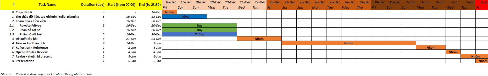

# PROGRAMMING FOR DATA SCIENCE - FIT - HCMUS
## Final Project - Thu thập, phân tích cho trả lời câu hỏi về bộ dữ liệu MyAnimeList
### I. Thông tin nhóm:
- Lớp: 20KHDL2

#|Họ tên
-|-
20127383|Lê Ngọc Tường
20127484|Nguyễn Tư Duy

### II. Thông tin đề tài:
#### **_01. Dataset:_**
[MyAnimeList Anime and Manga Datasets](https://www.kaggle.com/datasets/andreuvallhernndez/myanimelist) chứa thông tin của 67.273 bộ truyện.

#### **_02. Meaningful questions:_**
- Những bộ manga nào là phù hợp đối với mỗi đối tượng (`demographics`) ? Mục đích: cải thiện hệ thống khuyến nghị (recommendation system) của MAL.
- .
- .
- .

#### **_03. Questions analysis:_**
- Câu hỏi 1:
  - Đầu tiên là tìm thể loại (`genres`) phổ biến nhất với từng đối tượng.
  - Sử dụng hồi quy tuyến tính dựa vào 3 đầu vào là `scored_by`, `members`, `favorites` để dự đoán `score`.
  - Đưa ra ngưỡng `score` khuyến nghị kết hợp với thể loại đã tìm được ở trên để recommend những manga mang tính khuyến nghị cao cho từng đối tượng. 

#### **_04. More Information:_**
- [Github](https://github.com/lengoctuong/Prj-Manga-Dataset_Programming4DS)
- [Trello](https://trello.com/b/kqDOvCG5/prj-manga-datasetprogramming4ds)

#### **_05. Planning:_**

